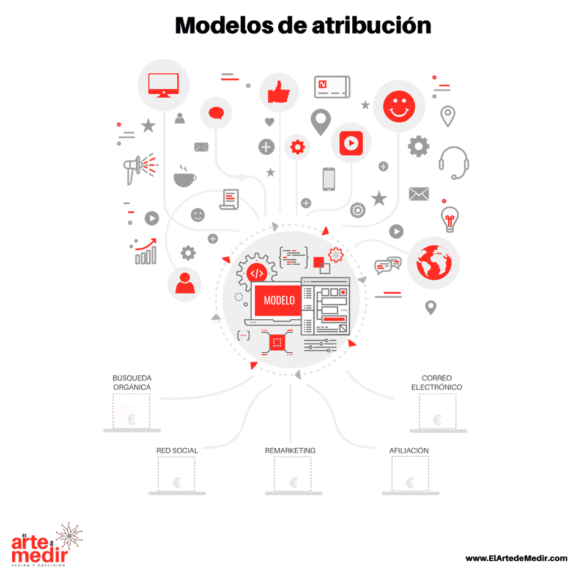

<style>                     
#image img {max-width: 500px; width: 500px; height: 500px}
</style> 

```{r setup, include=FALSE}
library(flexdashboard)
library(rchannelattribution)
library(highcharter)
library(tidyverse)
library(viridis)
library(knitr)
library(kableExtra)
library(readr)
```

Bienvedid@
===================================== 



Modelos de atribución
===================================== 

Inputs {.sidebar}
-----------------------------------------------------------------------

```{r}
fileInput("upload", 
          buttonLabel = "Examinar ...",
          label = "Importar rutas de conversión:",
          placeholder = "Archivo zip", 
          multiple = TRUE,
          accept = c("text/csv",
                     "text/comma-separated-values,text/plain",
                     ".csv",
                     ".zip"))

actionButton("process", "Calcular modelos")

## Download Button

p()
p()

renderUI({
  if(!is.null(model_data()) & !is.null(input$upload)) {
    downloadButton("download_csv", "Descargar Resultado")
  }
})

```


Row
-----------------------------------------------------------------------


### Resultados del modelo

```{r}
 model_data <- eventReactive(input$process, {
    if (is.null(input$upload))
      return(NULL)
   
    tmp_dir <- file.path(getwd(), 'tmp')
    
    on.exit(unlink(tmp_dir, recursive = T, force = T))

    cat(tmp_dir,"\n")
    
    in_file <- input$upload
    cat(in_file$datapath,"\n")
    
    file_ext <- tolower(regmatches(in_file$name, regexpr("\\.[[:alnum:]]{1,5}$", in_file$name)))
    
    if (file_ext %in% c('.zip')) {
      all_files <- unzip(zipfile = in_file$datapath, exdir = tmp_dir)
      all_files <- list.files('tmp', full.names = T)
      csv_files <- list.files('tmp', full.names = T, pattern = "*.csv")
      unlink(setdiff(all_files, csv_files),recursive = T)
    }
    
    import_path <- tmp_dir
    attribution_res <- data_driven_model(import_path)
    attribution_res 
    


  })

  # output$models <- renderDataTable({
  # 
  #   req(model_data())
  # 
  #   validate(
  #     need(model_data(), "getting user details")
  #   )
  # 
  #   model_data()$data
  # 
  # }, options = list(paging = FALSE,searching = FALSE))

renderUI( {
  req(model_data())
    validate(
        need(model_data(), "getting user details")
    )
  df <- model_data()$data %>% 
    select(path, dplyr::contains('total')) %>% 
    rename(Canal = path, Conversiones = total_conversions, Valor = total_conversion_value) %>% 
    mutate(Valor = cell_spec(
    format(round(Valor, 2), nsmall = 2), "html", color = "white", bold = T,
    background = "#7FC64F", align = "right")) %>%
  kable("html", escape = F) %>%
  kable_styling(bootstrap_options = c("striped", "condensed","hover")) %>%
  scroll_box()

  HTML(df)
})

output$download_csv <- downloadHandler(
    filename = function() { paste('attribution.csv', sep='') },
    content = function(file) {

      readr::write_excel_csv2(model_data()$data %>% 
    select(path, dplyr::contains('total')) %>% 
    rename(Canal = path, Conversiones = total_conversions, Valor = total_conversion_value),path =file)
    #   write.table(model_data()$data %>% 
    # select(path, contains('total')) %>% 
    # rename(Canal = path, Conversiones = total_conversions, Valor = total_conversion_value), file, sep = ";", row.names = F,fileEncoding = 'UTF-8' )
    }
  )
  
# DT::renderDataTable({
#   req(model_data())
#   validate(
#       need(model_data(), "getting user details")
#   )
#   model_data()$data %>% 
#     select(path, contains('total'))
# }, options = list(paging = FALSE,searching = FALSE))  
  
```


### Comparativa con otros modelos

```{r}
renderHighchart({
  req(model_data())
  validate(
      need(model_data(), "getting user details")
  )
  conversion_value.df <- model_data()$data
  highchart() %>%
  hc_chart(type = "column") %>%
  hc_xAxis(categories = conversion_value.df$path) %>%
  hc_add_series(name = "Modelo basado en datos", data = conversion_value.df$total_conversion_value, color=viridis::inferno(4)[1]) %>%
  hc_add_series(name = "Última interacción", data = conversion_value.df$last_touch_value, color=viridis::inferno(4)[2]) %>%
  hc_add_series(name = "Primera interacción", data = conversion_value.df$first_touch_value, color=viridis::inferno(4)[3]) %>%
  hc_add_series(name = "Lineal", data = conversion_value.df$linear_touch_value, color=viridis::inferno(4)[4]) %>%
  hc_yAxis(gridLineWidth = 0,labels = list(format = "{value} €", useHTML = TRUE, title = list(text = "Ingresos"))) %>%
  hc_xAxis(title = list(text = "Canal")) %>%
  hc_yAxis(title = list(text = "Ingresos")) %>%
  hc_tooltip(headerFormat = "<b>{series.name}</b><br>",
             pointFormat = "{point.y} euros")  %>%
  hc_title(text = "Comparativa entre modelos",
           useHTML = TRUE, margin = 50,
           align = "left",
           style = list(color = viridis::magma(3)[2])) %>%
  hc_subtitle(text="Importe generado por las conversiones según cada uno de los modelos",
              align = "left",
              useHTML = TRUE,
              margin = 50)
})

```


Row {.tabset .tabset-fade}
-----------------------------------------------------------------------


### Interacciones entre canales

```{r}
renderHighchart({
  req(model_data())
  validate(
      need(model_data(), "getting user details")
  )

tm <- model_data()$transition_matrix %>% 
  spread(key= channel_to, value = transition_probability) %>% 
  replace(., is.na(.), 0)

tm_mat <- as.matrix(tm[-1]) * 100
row.names(tm_mat) <- tm$channel_from
hchart(tm_mat, type = "heatmap") %>%
  hc_colorAxis(stops = color_stops(colors = rev(viridis::inferno(8)))) %>%
  # hc_colorAxis(minColor = "#FFFFFF", maxColor = "#434348") %>%
  hc_xAxis(gridLineWidth = 0,
           labels = list(enabled = T, format = "{value}", useHTML = TRUE),
           title = list(text = "Ingresos")) %>%
  hc_xAxis(title = list(text = "Canal #2")) %>%
  hc_yAxis(title = list(text = "Canal #1")) %>%
  hc_title(text = "Interacciones entre canales",
           useHTML = TRUE, margin = 50,
           align = "left",
           style = list(color = viridis::magma(3)[2])) %>%
  hc_subtitle(text="Probabilidad de impacto por el canal #2 tras ser impacatado por el canal #1", 
              align = "left",useHTML = TRUE, margin = 50)

})


```


### Importancia del canal
```{r}


renderHighchart({
  req(model_data())
  validate(
      need(model_data(), "getting model data")
  )

  re_df <- model_data()$removal_effect
  
  print(head(re_df))

  highchart() %>%
    hc_chart(type = "line", polar=T) %>%
    hc_xAxis(categories = re_df$channel_name) %>%
    hc_add_series(name = "Removal effect",
                  data = re_df$removal_effects_conversion * 100,
                  dataLabels = list(enabled = TRUE, format = '{point.y:.1f}'),
                  color=viridis::inferno(4)[1]) %>%
    # hc_add_series(name = "Última interacción", data = re_df$removal_effects_conversion_value) %>%
    hc_yAxis(type = "logarithmic",gridLineWidth = 0,labels = list(enabled = F, format = "{value} %", useHTML = TRUE, title = list(text = "Ingresos"))) %>%
    hc_xAxis(title = list(text = "Canal")) %>%
    hc_yAxis(title = list(text = "Ingresos")) %>%
    hc_tooltip(headerFormat = "<b>{series.name}</b><br>",
               pointFormat = "{point.y}%")  %>%
    hc_title(text = "Importancia del canal",
             useHTML = TRUE, margin = 50,
             align = "left",
             style = list(color = viridis::magma(3)[2])) %>% 
    hc_subtitle(text="Porcentaje de transacciones que se perderían de no existir el canal", align = "left",useHTML = TRUE, margin = 50)
  })
```

Ayuda
===================================== 


